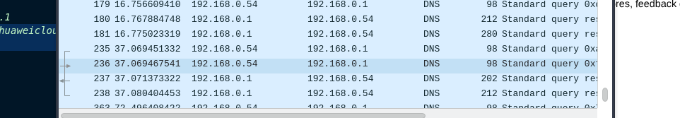

# informe

fe de erratas: el informe enviado previamente tenia un error respecto la consulta iterativa, (por algun motivo puse recursiva) aca la consulta iterativa: 

```shell
dig bocajuniors.com.ar +trace   
```

respuesta:

```shell

ceni@ws-debceni:~$ dig bocajuniors.com.ar +trace

; <<>> DiG 9.20.18-1~deb13u1-Debian <<>> bocajuniors.com.ar +trace
;; global options: +cmd
.			3722	IN	NS	f.root-servers.net.
.			3722	IN	NS	i.root-servers.net.
.			3722	IN	NS	h.root-servers.net.
.			3722	IN	NS	g.root-servers.net.
.			3722	IN	NS	l.root-servers.net.
.			3722	IN	NS	d.root-servers.net.
.			3722	IN	NS	e.root-servers.net.
.			3722	IN	NS	b.root-servers.net.
.			3722	IN	NS	m.root-servers.net.
.			3722	IN	NS	c.root-servers.net.
.			3722	IN	NS	a.root-servers.net.
.			3722	IN	NS	j.root-servers.net.
.			3722	IN	NS	k.root-servers.net.
.			3722	IN	RRSIG	NS 8 0 518400 20260403170000 20260321160000 21831 . Fqjd6MqXNrNAzqjD5YBnQ6s3CaCVs9e8TlMKbXgW1y+kxyija3Ht8xEQ CvYWueWNq4xNgq154QGKYsblLPA5B04g3p7D7fB5mTLMJZ7G2nvP097H WSnfdpSsRSOtYu2/b8DzX89FZG9iSN3Z3DRjWzQOjt48erKSCPByM4I3 CWIxvIE8TzfR4qUifMC+Rg7m/dS/zze3RJR1WAVPieYhDJsx/Kx0DBi5 Z3Cb/Z/JZ7ChtVNIWv7t6JYPiPyaxjc1np6JvYO2pu1YfgBe7IwfJWBf W4SelWq8g4iMQdxNTvIYVlvcBjN1wmTVOsJOK+gFqHrMKMmvObshq4t9 uoKcLQ==
;; Received 525 bytes from 192.168.0.1#53(192.168.0.1) in 12 ms

ar.			172800	IN	NS	a.lactld.org.
ar.			172800	IN	NS	c.dns.ar.
ar.			172800	IN	NS	d.dns.ar.
ar.			172800	IN	NS	e.dns.ar.
ar.			172800	IN	NS	f.dns.ar.
ar.			86400	IN	DS	19606 8 2 4415CF1A2CF10DE94B92BC020F21D1BF4163B2E90F2A6F6A5D2A1740 339D566C
ar.			86400	IN	RRSIG	DS 8 1 86400 20260404170000 20260322160000 21831 . Uxu0Qih/5VSWYeYrpiyzK6yILG+O2J0noUe7KKRQWDlOo6gVy1xcNptH TQfREmOWzfmHsHtfP1hVfCXSiz6/Hca/3jIz7DYm8z6t5JRg05f42cqG eTlXyLwoRkSsdh8nfVe6Lb0XzSEwGfmn1zOVHFLYk8Dc52CIpjyMLmVd NHH2reMFugz+DHWgRVWBDQ27mJ17SpNnHdYmbErUxXPyW71lCQ91oMYr xaVE11QE/vZV26I27AgCHA3b0g8jsjy+CLXvpuMe7hciTfLTd/qnvJoh dtYVSgcy9UVj4fQjvtSt+7L6YYa67e4n+Z8PK0O6GtfW3FFi/tqPJasY lcrNTw==
;; Received 698 bytes from 170.247.170.2#53(b.root-servers.net) in 156 ms

bocajuniors.com.ar.	7200	IN	NS	ns1.huaweicloud-dns.com.
bocajuniors.com.ar.	7200	IN	NS	ns1.huaweicloud-dns.net.
bocajuniors.com.ar.	7200	IN	NS	ns1.huaweicloud-dns.cn.
bocajuniors.com.ar.	7200	IN	NS	ns1.huaweicloud-dns.org.
405SR9UO3IVDU11IE8S6V6H7TUPMO6RM.com.ar. 7200 IN NSEC3 1 0 0 - 4060J8R5FUDV5UKB3T6BPK4A7KAP4H98 NS
405SR9UO3IVDU11IE8S6V6H7TUPMO6RM.com.ar. 7200 IN RRSIG NSEC3 8 3 7200 20260408134732 20260310110553 6930 com.ar. l4oCATXi3NJS1iCeDiQtkrZWqps+owq9zVMasyVuol4ulAewL2/jA9X6 DFVXTjOEUiAT7XJbZtRgaqOi5pBIyr7boGfTzJzFrwIEXZCMiWz4ulUD oBDvi7JdhXRQZOxN6Bif2CeKSOrZlR4ovrHj9foXM2zZVL0w/BR/Pyuj nPIPRsJKB2gJJamYCS87QXani2dSSGrkuQC2nqIsLPEGD9LN45gvXu// D6sd3RpdDPL1ShTXxQDJnAt+/NMHyG8NRyM1FQREoOCJufAkqzHYfnid eN+5mVYcHz3LOWVhy5y4wGcMW8/cBzLlpTjV4YLZUVlRL/RkvPnDjcQB woGjHA==
;; Received 590 bytes from 192.140.126.50#53(d.dns.ar) in 48 ms

bocajuniors.com.ar.	3600	IN	A	198.202.211.1
;; Received 63 bytes from 159.138.208.3#53(ns1.huaweicloud-dns.net) in 44 ms

```




