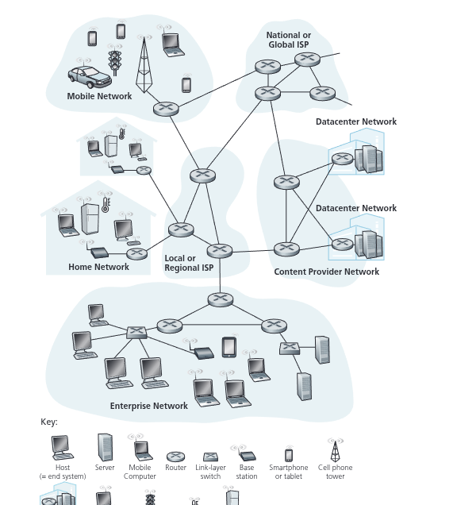
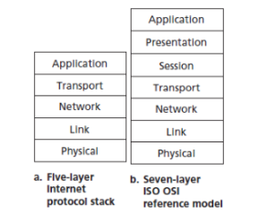

# unidad 1, el internet

el internet publica es un tipo de red de computadoras que conecta millones de computadoras (hoy en dia es mas abarcativo que eso) la internet es una red de redes, es decir, es una red que conecta otras redes, son todos los equipos, enlaces y protocolos que permiten la comunicación entre computadoras a nivel mundial.




## end system(host)

son los dispositivos que se conectan a la red, pueden ser computadoras, teléfonos inteligentes, tabletas, etc. Estos dispositivos pueden enviar y recibir datos a través de la red mediante rede de enlaces(communication links) y packet switching.

## enlaces de comunicación(communication links)

transmite datos en forma de paquetes desde un sistema final a otro, pueden ser alámbricos (como cables de fibra óptica o cables de cobre) o inalámbricos (como Wi-Fi o redes celulares).

## packet switching

un switch recibe un paquete por una entrada y lo envia por una salida, hoy en dia los dos tipos mas comunes son routers y linklayer switches, los routers se encargan de dirigir el tráfico entre diferentes redes, mientras que los linklayer switches se encargan de dirigir el tráfico dentro de una misma red.

al camino que hace un paquete desde que sale se lo llama route o path 

## isps(internet service providers)

son empresas que proporcionan acceso a internet a los usuarios finales, pueden ser proveedores de servicios de banda ancha, proveedores de servicios móviles, etc. Los ISPs también pueden proporcionar servicios adicionales como alojamiento web, correo electrónico, etc.

los isps deben conectarse entre si, las isps estan interconectadas a traves de puntos de intercambio de internet (IXPs) y acuerdos de peering, esto permite que los datos puedan viajar entre diferentes redes y llegar a su destino final.

## protocolos

son un conjunto de reglas y estándares que permiten la comunicación entre dispositivos en una red, algunos ejemplos de protocolos comunes en internet son el protocolo de control de transmisión (TCP), el protocolo de internet (IP), el protocolo de transferencia de hipertexto (HTTP), etc. Estos protocolos definen cómo se deben enviar y recibir los datos, cómo se deben manejar los errores, etc.

## socket

es una interfaz de programación de aplicaciones (API) que permite a los programas de computadora comunicarse a través de una red, un socket es un punto final de una conexión de red, se utiliza para enviar y recibir datos a través de la red. Los sockets pueden ser utilizados para crear aplicaciones cliente-servidor, donde un programa actúa como servidor y espera conexiones entrantes, mientras que otro programa actúa como cliente y se conecta al servidor para enviar o recibir datos.

## medios donde viajan los datos

los datos pueden viajar a través de diferentes medios, como cables de fibra óptica, cables de cobre, ondas de radio, etc. La elección del medio depende de factores como la distancia, el ancho de banda requerido, el costo, etc. Por ejemplo, para conexiones de larga distancia se suelen utilizar cables de fibra óptica debido a su alta capacidad y baja atenuación, mientras que para conexiones inalámbricas se utilizan ondas de radio.

## flujo de envio de datos

para enviar un mensaje de una fuente se dividen pedazos largos de informacion en paquetes mas pequeños, los paqeutes se envian mediante un enlace cuyo rate es la cantidad de bits del paquete L[bits] dividido por el tiempo que tarda en enviar el paquete T[segundos], es decir, R = L/T [bits/segundo].

la mayoria de switches usan transmision store-and-forward, es decir, el switch recibe el paquete completo, lo almacena temporalmente y luego lo reenvia al destino. Esto permite que el switch verifique la integridad del paquete antes de enviarlo, pero también introduce un retraso adicional en la transmisión.

un router sabes a donde enviar los paquetes por la ip de destino, cada router tiene una tabla de enrutamiento que le indica a donde enviar los paquetes dependiendo de la ip de destino, el router utiliza algoritmos de enrutamiento para determinar la mejor ruta para enviar los paquetes, esto puede ser basado en la distancia, el costo, el ancho de banda disponible, etc.

## tiempo de ida y vuelta (RTT)

es el tiempo que tarda un paquete en viajar desde la fuente hasta el destino y luego regresar a la fuente, se puede medir utilizando herramientas como ping, el RTT es un indicador importante de la latencia de la red, cuanto menor sea el RTT, mejor será la experiencia del usuario al interactuar con aplicaciones en línea.


## que factores afectan al tiempo de transmision en una red

### tiempo de procesamiento

es el tiempo que tarda un dispositivo en procesar un paquete, esto puede incluir la verificación de la integridad del paquete, la toma de decisiones de enrutamiento, etc. El tiempo de procesamiento puede variar dependiendo del dispositivo y la carga de trabajo.

```math
T_{procesamiento} = \frac{L}{R}
```
donde L es el tamaño del paquete en bits y R es la tasa de transmisión en bits por segundo.

### tiempo de cola 

es el tiempo que un paquete pasa esperando en una cola antes de ser procesado, esto puede ocurrir cuando hay congestión en la red o cuando el dispositivo está ocupado procesando otros paquetes. El tiempo de cola puede variar dependiendo de la carga de trabajo y la capacidad del dispositivo.

```math
T_{cola} = \frac{N}{R}
```
donde N es el número de paquetes en la cola y R es la tasa de transmisión en bits por segundo.

### tiempo de insercion en el medio

es el tiempo que tarda el transmisor en empujar todos los bits de un paquete al medio de transmisión, esto depende del tamaño del paquete y la tasa de transmisión.

```math
T_{insercion} = \frac{L}{R}
```
donde L es el tamaño del paquete en bits y R es la tasa de transmisión en bits por segundo.

### tiempo de propagacion

es el tiempo que tarda un bit en viajar desde el transmisor hasta el receptor, esto depende de la distancia entre el transmisor y el receptor y la velocidad de propagación del medio de transmisión.

```math
T_{propagacion} = \frac{d}{v}
```

donde d es la distancia entre el transmisor y el receptor y v es la velocidad de propagación del medio de transmisión.

para propositos practicos, tomaremos tiempo de procesamiento y tiempo de encolamiento como 0, es decir, asumiremos que no hay retrasos adicionales en la transmisión de los paquetes, esto nos permite centrarnos en el tiempo de inserción y el tiempo de propagación como los principales factores que afectan el tiempo de transmisión en una red.

## arquitectura de capas



la arquitectura de capas es un modelo de diseño de redes que divide la funcionalidad de la red en capas, cada capa tiene una función específica y se comunica con las capas adyacentes a través de interfaces bien definidas, esto permite una mayor modularidad y flexibilidad en el diseño y la implementación de redes.

en un principio eran 7 capas pero hoy en dia se utilizan 5 capas, que son:

### capa de aplicacion

es la capa más alta de la arquitectura de capas, es donde viven las aplicaciones, se encarga de proporcionar servicios de red a las aplicaciones de usuario, algunos ejemplos de protocolos de capa de aplicación son HTTP, FTP, SMTP, etc.

### capa de transporte

es la capa que se encarga de proporcionar servicios de transporte de datos entre aplicaciones, algunos ejemplos de protocolos de capa de transporte son TCP y UDP, TCP proporciona una conexión confiable y orientada a la conexión, mientras que UDP proporciona una conexión no confiable y sin conexión.

### capa de red

es la capa que se encarga de enrutar los paquetes a través de la red, algunos ejemplos de protocolos de capa de red son IP, ICMP, etc. La capa de red se encarga de asignar direcciones IP a los dispositivos y enrutar los paquetes a su destino final.

### capa de enlace de datos

es la capa que se encarga de la transmisión de datos a través de un enlace físico, algunos ejemplos de protocolos de capa de enlace de datos son Ethernet, Wi-Fi, etc. La capa de enlace de datos se encarga de la detección y corrección de errores, así como del control de acceso al medio.

### capa física

es la capa más baja de la arquitectura de capas, se encarga de la transmisión de bits a través de un medio físico, algunos ejemplos de medios físicos son cables de fibra óptica, cables de cobre, ondas de radio, etc. La capa física se encarga de la codificación y modulación de los datos para su transmisión a través del medio físico.

