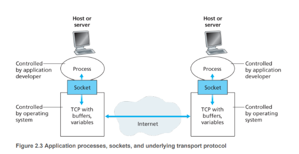

# unidad 2 capa de aplicaciones

como vimos en la unidad anterior, la arquitectura de capas es un modelo de diseño de redes que divide la funcionalidad de la red en capas, cada capa tiene una función específica y se comunica con las capas adyacentes a través de interfaces bien definidas, esto permite una mayor modularidad y flexibilidad en el diseño y la implementación de redes, una capa puede comunicarse con la capa superior e inferior a través de interfaces bien definidas, esto permite que las capas sean independientes entre sí y facilita la implementación y el mantenimiento de la red.

en esta unidad nos centraremos en la capa de aplicación, que es la capa más alta de la arquitectura de capas, es donde viven las aplicaciones, se encarga de proporcionar servicios de red a las aplicaciones de usuario, algunos ejemplos de protocolos de capa de aplicación son HTTP, FTP, SMTP, etc.

los paradigmas predominantes en la capa de aplicación son el cliente-servidor y el peer-to-peer

## cliente-servidor

en el paradigma cliente-servidor, un dispositivo actúa como servidor y proporciona servicios a otros dispositivos que actúan como clientes, el servidor es responsable de procesar las solicitudes de los clientes y proporcionar respuestas, algunos ejemplos de aplicaciones cliente-servidor son los servidores web, los servidores de correo electrónico, etc.

### caracteristicas del cliente-servidor

- los clientes no interactúan directamente entre sí, sino que se comunican a través del servidor

- el servidor tiene ip fija y conocida tal que los clientes pueden localizarlo fácilmente

## aplicaciones p2p

en el paradigma peer-to-peer (p2p), los dispositivos actúan como iguales y pueden comunicarse directamente entre sí sin la necesidad de un servidor central, cada dispositivo puede actuar como cliente y servidor al mismo tiempo, si bien se tiene una especie de servidor central que es el tracker, este se encarga de mantener un registro de los peers disponibles y facilitar la conexión entre ellos, algunos ejemplos de aplicaciones p2p son los sistemas de intercambio de archivos como BitTorrent, etc.


## sockets

las aplicaciones en la red consisten de pares de procesos que se envian mensajes entre si a traves de la red, estos se mandan mensajes a traves de una interfaz llamada socket.

un socket es un punto final de una conexión de red, es una abstracción que permite a las aplicaciones enviar y recibir datos a través de la red, se puede pensar como una API entre la aplicacion y la red.

el desarrollador posee la capacidad de ajutar algunos parametros de los socket como la eleccion del protocolo, el puerto, algunos parametos, el tamaño del buffer y de los segmentos, etc.



para que un proceso pueda enviar enviarle algo a otro proceso este ultimo tiene que tener una una direccion, para ello se utiliza una direccion ip y un numero de puerto, la direccion ip identifica al host en la red, mientras que el numero de puerto identifica al proceso dentro del host, esto permite que los procesos puedan comunicarse entre sí a través de la red utilizando sockets.

## servicios que ofrece el protocolo de la capa de transporte

- transferencia de datos confiable: el protocolo de la capa de transporte puede garantizar que los datos se transfieran de manera confiable entre los procesos, esto significa que los datos se entregarán sin errores y en el orden correcto.

- caudal(throughput): el protocolo de la capa de transporte puede proporcionar un caudal adecuado para la transferencia de datos, esto significa que puede manejar grandes cantidades de datos de manera eficiente.

- timing: se podria garantizar que ningun bit tarde mas de X ms en llegar a destino, esto es importante para aplicaciones en tiempo real como la videoconferencia o los juegos en línea.

- seguridad: el protocolo de la capa de transporte puede proporcionar mecanismos de seguridad para proteger los datos durante la transferencia, esto puede incluir cifrado, autenticación, etc.

## protocolos de transporte

internet provee 2 protocolos de transporte principales: TCP y UDP, cada uno tiene sus propias características y se utiliza para diferentes tipos de aplicaciones.

## TCP (Transmission Control Protocol)

provee dos servicios principales: transferencia de datos confiable y control de flujo, TCP garantiza que los datos se entregarán sin errores y en el orden correcto, esto se logra mediante el uso de acuses de recibo (ACKs) y retransmisiones en caso de pérdida de paquetes, TCP también proporciona control de flujo para evitar que el remitente envíe más datos de los que el receptor puede manejar, se lo puede mejorar con SSL para proporcionar seguridad adicional mediante cifrado y autenticación.

## UDP (User Datagram Protocol)

es protocolo de servicios minimos, es connexionless(no hace handshake), no garantiza la entrega de datos, no garantiza el orden de los datos, no proporciona control de flujo, es mas rapido que TCP pero menos confiable, se lo puede mejorar con DTLS para proporcionar seguridad adicional mediante cifrado y autenticación.

hoy en dia internet nno da garantias de timing ni de rendimiento sin embargo suele funcionar bien.

## http (Hypertext Transfer Protocol)

es el protocolo principal de la capa de aplicaciones web, se implementa en el cliente- srvidor, ambas partes intercambian mensajes HTTP, una pagina web conciste de objetos, archviso accesibles por url, pueden ser imagenes, archivos HTML, js, etc.

cada url se compone de dos elementos, nombre de host y ruta, http utiliza tcp como protocolo de transporte

las conexiones persistentes son aquellas donde se una misma conexion tcp se utiliza para enviar y recibir multiples mensajes HTTP, esto permite reducir la sobrecarga de establecer una nueva conexion TCP para cada mensaje HTTP, lo que mejora el rendimiento de la comunicación entre el cliente y el servidor.

un archivo http toma 2RTT para ser transferido, el primer RTT se utiliza para establecer la conexión TCP entre el cliente y el servidor, mientras que el segundo RTT se utiliza para enviar la solicitud HTTP desde el cliente al servidor y recibir la respuesta HTTP del servidor al cliente. Sin embargo, si se utilizan conexiones persistentes, el tiempo de transferencia puede reducirse a 1RTT, ya que la conexión TCP ya está establecida y solo se necesita un RTT para enviar la solicitud HTTP y recibir la respuesta HTTP.

este suele vivir en el puerto 80, aunque también se puede utilizar el puerto 443 para HTTP con SSL (HTTPS), esto proporciona seguridad adicional mediante cifrado y autenticación, lo que es especialmente importante para aplicaciones web que manejan información sensible como datos de tarjetas de crédito, información personal, etc.

## header de http

el header de http es un conjunto de campos que se incluyen en la solicitud y respuesta HTTP, estos campos proporcionan información adicional sobre la solicitud o respuesta, como el tipo de contenido, la longitud del contenido, las cookies, etc. El header de http es importante para que el cliente y el servidor puedan comunicarse de manera efectiva y proporcionar una experiencia de usuario adecuada.

```
Request-Line   = Method SP Request-URI SP HTTP-Version CRLF
Header        = Field-Name ":" SP Field-Value CRLF
Blank Line    = CRLF
Message Body   = *OCTET
```

los metodos pueden ser GET, POST, PUT, DELETE, etc. cada metodo tiene una funcion especifica, por ejemplo, el metodo GET se utiliza para solicitar un recurso del servidor, mientras que el metodo POST se utiliza para enviar datos al servidor.

```
Status-Line = HTTP-Version SP Status-Code SP Reason-Phrase CRLF
Header      = Field-Name ":" SP Field-Value CRLF
Blank Line  = CRLF
Message Body = *OCTET
```

algunos codigos comunes seria:

200 OK: la solicitud se ha procesado correctamente

301 Moved Permanently: el recurso solicitado se ha movido permanentemente a una nueva URL

400 Bad Request: la solicitud no se ha podido procesar debido a un error del cliente1

404 Not Found: el recurso solicitado no se ha encontrado en el servidor

500 Internal Server Error: se ha producido un error en el servidor al procesar la solicitud

505 HTTP Version Not Supported: la versión de HTTP utilizada en la solicitud no es compatible con el servidor


si bien una conexion http es stateless, es decir, el servidor no mantiene información sobre las solicitudes anteriores del cliente, se pueden utilizar cookies para mantener el estado entre las solicitudes, las cookies son pequeños archivos de texto que se almacenan en el cliente y se envían al servidor con cada solicitud HTTP, esto permite que el servidor pueda identificar al cliente y mantener información sobre su sesión, preferencias, etc.

### cache web

es un mecanismo que permite almacenar temporalmente copias de recursos web en el cliente o en servidores intermedios, esto permite reducir la latencia y mejorar el rendimiento de la comunicación entre el cliente y el servidor, cuando un cliente solicita un recurso web, el servidor puede incluir información en el header de la respuesta HTTP para indicar si el recurso se puede almacenar en caché y por cuánto tiempo, esto permite que el cliente pueda almacenar una copia del recurso y utilizarla para futuras solicitudes, lo que reduce la necesidad de volver a descargar el recurso desde el servidor cada vez que se solicita.

## SMTP (Simple Mail Transfer Protocol)

es el protocolo principal para el envío de correo electrónico, se implementa en el cliente-servidor, el cliente de correo electrónico envía un mensaje al servidor de correo electrónico utilizando SMTP, el servidor de correo electrónico luego entrega el mensaje al destinatario utilizando SMTP o lo almacena para que el destinatario lo recupere más tarde utilizando un protocolo como POP3 o IMAP, su mayor diferencia con http es que el http es un protocolo de polling, es decir, el cliente solicita información al servidor, mientras que el SMTP es un protocolo de push, es decir, el cliente envía información al servidor sin necesidad de que el servidor la solicite.


un sistema de correo electrónico típico consta de tres componentes principales: el cliente de correo electrónico, el servidor de correo electrónico y el protocolo de transporte. El cliente de correo electrónico es la aplicación que los usuarios utilizan para enviar y recibir correos electrónicos(outlock, gmail, etc), el servidor de correo electrónico es el software que se ejecuta en un servidor y se encarga de recibir, almacenar y entregar los correos electrónicos, mientras que el protocolo de transporte es el conjunto de reglas que se utilizan para enviar y recibir correos electrónicos a través de la red.

SMPT usa TCP como protocolo de transporte, el puerto por defecto para SMTP es el puerto 25, aunque también se pueden utilizar otros puertos como el puerto 587 para SMTP con autenticación y el puerto 465 para SMTP con SSL.

## dns (Domain Name System)

es un sistema de nombres de dominio que se utiliza para traducir nombres de dominio legibles por humanos (como www.ejemplo.com) en direcciones IP numéricas que las computadoras pueden entender, el DNS es esencial para el funcionamiento de internet, ya que permite a los usuarios acceder a sitios web y otros recursos utilizando nombres de dominio en lugar de tener que recordar direcciones IP numéricas.