# capa de transporte

la capa de transporte provee comunicacion logica entre aplicaciones, osea que para el usuario es como si las aplicaciones se comunicaran directamente, sin importar la red que hay entre ellas aunque fisicamenta haya routers y switches entre ellas, la capa de transporte se encarga de que los datos lleguen a su destino y que se mantenga la comunicacion entre las aplicaciones

estos protoclos viven en los hosts pero no en los routers(idealmente) convierten mensajes de la capa de aplicacion en segmentos, y se encargan de enviar esos segmentos a la capa de red, y tambien reciben segmentos de la capa de red y los convierten en mensajes para la capa de aplicacion

el protocolo de transporte mueve la informacion al borde de la red(la capa de red) y viceversa pero como tal no tiene nada que ver con la informacion que viaja dentro de la red.

estos servicios de transporte estan limitados por los servicios de la capa de red, si la capa de red no puede garantizar los tiempos de demora o el bandwidth tampoco puede hacerlo la capa de transporte.

el protocolo de red de internet es IP, el modelo ip es best effort, lo que significa que no garantiza nada, no garantiza que los paquetes lleguen a su destino, ni el orden en el que llegan, ni que no se pierdan, ni que no se dupliquen, ni que no se corrompan, por eso la capa de transporte tiene que encargarse de garantizar la comunicacion entre las aplicaciones.

las principal responsabilidad de UDP y TCP es la de exteneder el servicio de entrega en dos host a un servicio de entraga entre dos procesos corriendo en dichos host, esta extension se llama transport-layer multiplexing and demultiplexing

### multiplexing

multiplexing es el proceso de tomar datos de diferentes aplicaciones y combinarlos en un solo flujo de datos para enviarlos a través de la red, esto se hace para optimizar el uso de la red y reducir la cantidad de conexiones necesarias entre los host, por ejemplo si tenemos dos aplicaciones corriendo en un host y ambas quieren enviar datos a otro host, en lugar de crear dos conexiones separadas para cada aplicación, se puede usar multiplexing para combinar los datos de ambas aplicaciones en un solo flujo de datos y enviarlo a través de una sola conexión.

### demultiplexing

demultiplexing es el proceso de tomar un flujo de datos que llega a un host y separarlo en diferentes flujos de datos para enviarlos a las aplicaciones correspondientes, esto se hace para que cada aplicación reciba solo los datos que le corresponden, por ejemplo si tenemos un host que recibe un flujo de datos que contiene datos de dos aplicaciones diferentes, el host puede usar demultiplexing para separar los datos de cada aplicación y enviarlos a las aplicaciones correspondientes.

ademas provee un chequeo de errores en los headers de los segmentos, UDP solo garantiza esas dos cosas, por eso se dice unreliable, TCP provee mas servicios como transderencia de datos confialbles y control de flujo, por eso se dice reliable, pero ambos protocolos proveen multiplexing y demultiplexing y chequeo de errores en los headers de los segmentos.

en el header tienen que estar seteados dos campos

### puerto de origen y puerto de destino

el puerto de origen es el puerto desde el cual se esta enviando el segmento, y el puerto de destino es el puerto al cual se esta enviando el segmento, estos puertos son necesarios para que la capa de transporte pueda hacer multiplexing y demultiplexing, ya que cada aplicación corre en un puerto diferente, por ejemplo si tenemos una aplicacion corriendo en el puerto 80 y otra aplicacion corriendo en el puerto 8080, cuando llega un segmento al host con el puerto de destino 80, la capa de transporte sabe que ese segmento es para la aplicacion que corre en el puerto 80, y cuando llega un segmento con el puerto de destino 8080, la capa de transporte sabe que ese segmento es para la aplicacion que corre en el puerto 8080.

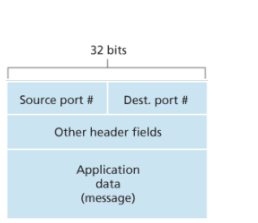

### diferencias entre los socket tpc y udp

un socket tcp se identifica por cuatro campos, el puerto de origen, el puerto de destino, la direccion ip de origen y la direccion ip de destino, esto se llama un socket tcp porque es una conexion orientada a conexion, es decir que se establece una conexion entre dos host antes de enviar datos, y esa conexion se mantiene durante toda la comunicacion, por lo tanto cada socket tcp es unico para cada par de host y aplicaciones que se estan comunicando, udp en cambio es connetionless, no usa handshakes para establecer una conexion, por lo tanto no mantiene una conexion entre los host, cada segmento udp se trata de manera independiente, por lo tanto un socket udp se identifica solo por el puerto de destino, ya que no hay una conexion establecida entre los host, por lo tanto varios host pueden enviar segmentos udp al mismo puerto de destino y la capa de transporte se encargara de demultiplexar esos segmentos y enviarlos a la aplicacion correspondiente.

DNS es un ejemplo de una aplicacion que usa UDP, ya que no necesita una conexion establecida entre los host, y cada consulta DNS se trata de manera independiente, por lo tanto cada consulta DNS se envia como un segmento udp con el puerto de destino 53, y la capa de transporte se encargara de demultiplexar esos segmentos y enviarlos a la aplicacion DNS correspondiente.

### porque usarias UDP en lugar de TCP

- mas controlo sobre que datos se envian: udp apenas proceso envia informacion a la capa de red, TCP tiene un sistema de controlo de congestion que lo deja esperando si estan muy cargados los enlaces, ademas como TCP garantiza que todo paquete llegue y llegue ordenado intenta reenviar la informacion hasta confirmar que llego bien, esto puede ser un problema para aplicaciones que necesitan enviar datos en tiempo real, como por ejemplo una aplicacion de streaming de video o una aplicacion de juegos en linea, ya que si la aplicacion esta esperando a que lleguen todos los paquetes para poder mostrar el video o el juego, puede haber un retraso significativo en la entrega de los datos, lo que puede afectar la experiencia del usuario, en cambio con UDP la aplicacion puede enviar los datos sin esperar a que lleguen todos los paquetes, lo que puede mejorar la experiencia del usuario en aplicaciones de tiempo real.

- no establece ninguna conexion: establecer conexion de base genera 2TTL, es decir que se necesitan al menos dos viajes de ida y vuelta para establecer una conexion entre dos host, esto puede ser un problema para aplicaciones que necesitan enviar datos de manera rápida, como por ejemplo una aplicacion de mensajeria instantanea o una aplicacion de voz sobre ip, ya que si la aplicacion esta esperando a que se establezca la conexion antes de enviar los datos, puede haber un retraso significativo en la entrega de los datos, lo que puede afectar la experiencia del usuario, en cambio con UDP la aplicacion puede enviar los datos sin esperar a que se establezca la conexion, lo que puede mejorar la experiencia del usuario en aplicaciones de mensajeria instantanea o voz sobre ip.

- no mantiene estados de conexion: mantener estados de conexion puede ser un problema para aplicaciones que necesitan enviar datos a muchos host diferentes, como por ejemplo una aplicacion de broadcasting o una aplicacion de multicast, ya que si la aplicacion esta manteniendo estados de conexion para cada host al que esta enviando datos, puede haber un consumo significativo de recursos en el host, lo que puede afectar el rendimiento de la aplicacion, en cambio con UDP la aplicacion puede enviar los datos sin mantener estados de conexion para cada host, lo que puede mejorar el rendimiento de la aplicacion en aplicaciones de broadcasting o multicast.

- headers mas cortos: TCP tiene 20 bytes de header overhead mientras que udp tiene 8 bytes de header overhead, esto puede ser un problema para aplicaciones que necesitan enviar datos pequeños, como por ejemplo una aplicacion de sensores o una aplicacion de internet de las cosas, ya que si la aplicacion esta enviando datos pequeños, el overhead del header puede ser significativo en comparación con el tamaño de los datos, lo que puede afectar la eficiencia de la entrega de los datos, en cambio con UDP la aplicacion puede enviar los datos con un overhead de header mas pequeño, lo que puede mejorar la eficiencia de la entrega de los datos en aplicaciones de sensores o internet de las cosas.

| Aplicacion | Protocolo de capa de aplicacion | Protocolo de transporte subyacente |
| --- | --- | --- |
| Correo electronico | SMTP | TCP |
| Acceso remoto a terminal | Telnet | TCP |
| Web | HTTP | TCP |
| Transferencia de archivos | FTP | TCP |
| Servidor remoto de archivos | NFS | Tipicamente UDP |
| Streaming multimedia | Tipicamente propietario | UDP o TCP |
| Telefonia por Internet | Tipicamente propietario | UDP o TCP |
| Administracion de red | SNMP | Tipicamente UDP |
| Resolucion de nombres | DNS | Tipicamente UDP |

cabe destacar que si bien UDP en si es no confiable se puede desde la capa de aplicacion implementar mecanismos de confiabilidad, por ejemplo DNS es una aplicacion que usa UDP pero implementa un sistema de retransmision para garantizar que las consultas DNS lleguen a su destino, por lo tanto aunque UDP no garantiza la entrega de los paquetes, la aplicacion puede implementar mecanismos para garantizar la entrega de los datos.

### checksum

el checksum es un mecanismo de deteccion de errores que se utiliza en la capa de transporte para verificar la integridad de los datos que se estan enviando, el checksum se calcula a partir de los datos del segmento y se incluye en el header del segmento, cuando el segmento llega a su destino, el receptor calcula el checksum a partir de los datos recibidos y lo compara con el checksum incluido en el header, si los dos checksums coinciden, se asume que los datos llegaron sin errores, si los dos checksums no coinciden, se asume que los datos llegaron con errores y se descartan, tanto TCP como UDP utilizan el checksum para verificar la integridad de los datos, aunque TCP tiene un sistema de retransmision para garantizar la entrega de los datos, mientras que UDP no tiene ese sistema de retransmision.

### ARQ automatic repeat request

son protocolos que retransmiten mensajes que se han perdido o corrompidos, TCP es un protocolo ARQ, ya que tiene un sistema de retransmision para garantizar la entrega de los datos, mientras que UDP no es un protocolo ARQ, ya que no tiene un sistema de retransmision para garantizar la entrega de los datos, requiere 3 capacidades para implementar un protocolo ARQ:
- deteccion de errores: el protocolo debe ser capaz de detectar cuando un mensaje se ha perdido o corrompido, esto se puede hacer utilizando el checksum para verificar la integridad de los datos, si el checksum no coincide, se asume que el mensaje se ha perdido o corrompido.
- feedback: el protocolo debe ser capaz de enviar una respuesta al emisor para indicar que un mensaje se ha perdido o corrompido, esto se puede hacer utilizando un mensaje de ACK (acknowledgment) para indicar que un mensaje ha sido recibido correctamente, o un mensaje de NACK (negative acknowledgment) para indicar que un mensaje ha sido perdido o corrompido.
- retransmision: el protocolo debe ser capaz de retransmitir un mensaje que se ha perdido o corrompido, esto se puede hacer utilizando un temporizador para esperar una respuesta del receptor, si no se recibe una respuesta dentro de un tiempo determinado, se asume que el mensaje se ha perdido o corrompido y se retransmite el mensaje.

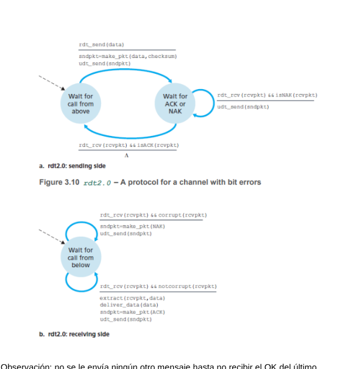

notese que no se envia ningun mensaje hasta confirmar que se recibio el ultimo mensaje, esto se llama stop-and-wait, una falla de dicho modelo es que no concideraz que el paquete envia la señal NAK o ACK pueda estar corrompido, una solucion seria reenviar esos paqueters el problema es que genera duplicados, para solucionar esto se agrega un nuevo campo llamado numero de secuenncia,asi se compara un paquete con el anterior y se verifica si son el mismo o no

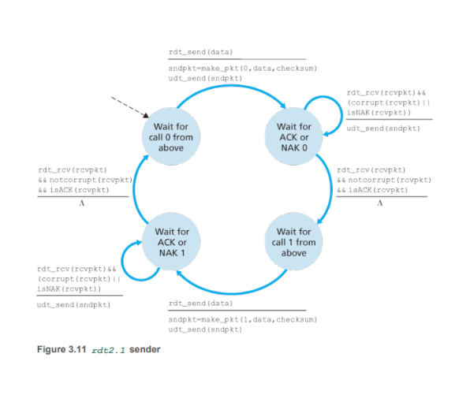

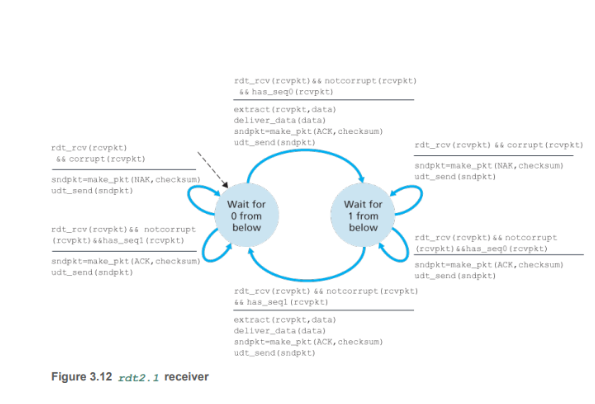

en el siguiente modelo se hace un modificacion, en vez de mandar señales NAK se manda una señal ACK por el ultimo paquete bien recibido, un sender recibe 2 ACK's por el mismo paquete que a va a saber que el receptor no recibio bien el paquete que le fue recibido doble, entonces ahora el receptor tiene que incluir el numero de secuencia del paquete reconocido por ACK, entoces ahora el receptor tiene que incluir el numero de secuencia del paquete reconocido por ACK y el enviador chequearlo

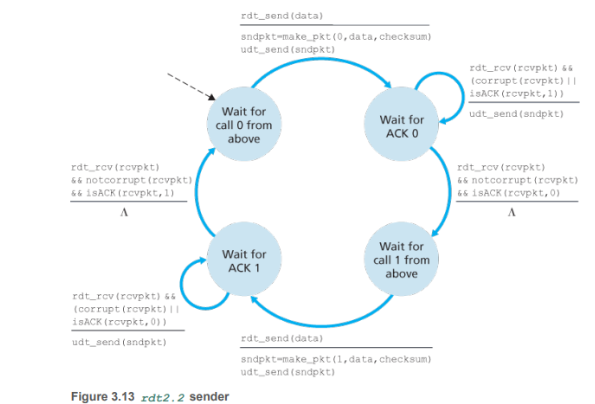

todo esto sin asumir que se pueda perder un paquete de ack, plo que llevaria a perdida de informacion, se puedce agregar un temporizador para esperar un ACK, si no se recibe un ACK dentro de un tiempo determinado, se asume que el paquete se ha perdido o corrompido y se retransmite el paquete, esto se llama timeout, este puede duplicar paquetes pero con lo modelado anteriormente se puede detectar y descartar los paquetes duplicados, se agrega la funcionalidad al enviador de comenzar un timer luego de enviar el paquete, responder una interrupcion de timer y detener el timer

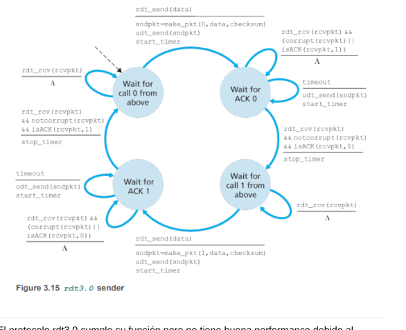

el protocolo rdt 3.0 cumple su funcion pero no tiene muy buen perormance debido al protocolo stop and wait, la solucion es el pipelining, que es enviar varios paquetes sin esperar a que lleguen los ACK's, esto se puede hacer utilizando una ventana deslizante, donde el enviador puede enviar varios paquetes dentro de una ventana de tamaño determinado, y el receptor puede recibir esos paquetes y enviar ACK's para cada paquete recibido correctamente, el enviador puede mantener un registro de los paquetes enviados y los ACK's recibidos, y puede retransmitir los paquetes que no han sido reconocidos por un ACK dentro de un tiempo determinado.

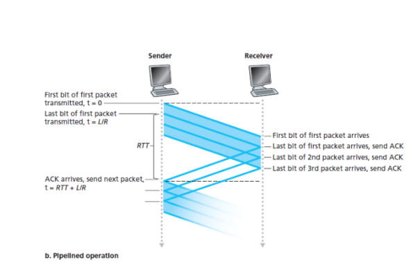

lo que conlleva incrementar el rango de numeros de secuencia, tener que guardar tanto receptor como emisor los paquetes en un buffer y el rango de numeros de secuencia va a depender de como responde el protocolo a la perdida, corrupcion o demora de paquete, existen 2 aproachs para el manejo de errores con pipelines

### go back n

el sender puede enviar multiples paquetes sin esperar el ack pero tiene limitacion hasta una N cantidad de paquetes sin reconocer, ese n se lo conoce como window sizey gbn como sliding window protocol.

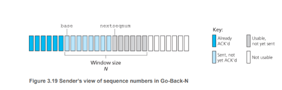

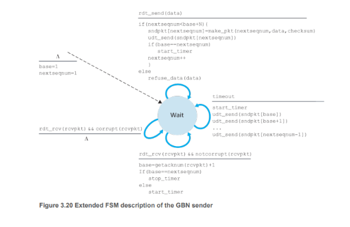

el sender tiene que responder a 3 tipos de eventos:

1. invocacion desde arriba: cuando se llama a rdt_send() se tiene que chequear que la ventana no este completa o sea que no haya mas de n paquetes sin reconocer, en una implementacion real habria un buffer o un flag de semafor para saber si se puede enviar algo o no.
2. recepcion de un ack: es acumulativo opor lo que por cada ack se debe reconocer los paquetes con numero de secuencia >= n.
3. timeout: si se produce un timeout, el sender tiene que retransmitir todos los paquetes que han sido enviados pero no reconocidos por un ack, es decir todos los paquetes con numero de secuencia >= n.

del lado receptor si se reciben bien y en orden con numero de secuencia n envia un ACK para los n paquetes recibidos, si se recibe un paquete con numero de secuencia mayor a n, se descarta el paquete y se vuelve a enviar un ACK para el ultimo paquete recibido correctamente, si se recibe un paquete con numero de secuencia menor a n, se vuelve a enviar un ACK para ese paquete, esto es para manejar los paquetes duplicados.

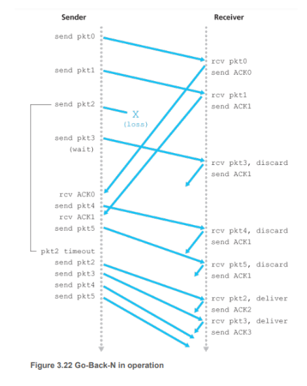

### selective repeat

hay casos donde GBN puede tener problemas de performance por ejemplo si se tiene una ventana grande y hay bandwith delay va a haber muchos paquetes en el pipeline y basta que alguna tenga error para tener que retransmitiro todos , el protocolo selective repeat retransmite solo los que sospecha que se hayan recibido con error, esto implica que los reconocimientos son individuales, el receptor reconoce un paquete que este o no en orden, los que esten desordenados se los guarda n un buffer hasta que llego un numero de menor secuencia y ahi se envian ordenados

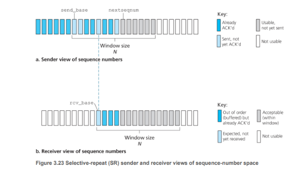

no siempre el sender y el receiver van a tener la misma vista de que paquete se recibio o no, no siempre van a coincidir las ventanas

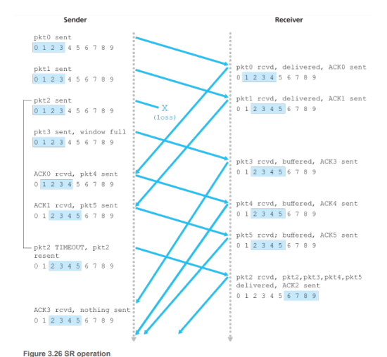

### otras caracteristicas del modelo TCP

- estos son connection oriented porque siempre se tiene que establecer un handshake inicial, esta primera comunicacion inicializa variables de conexion.

- una conexion tcp provee un servicio full duplex, si hay una conexion TCP entre un proceso A en un host y un proceso B en otro entonces los datos de la cpa de aplicaciones puedeb viajar tanto de A a B como de B a A al mismo tiempo.

- una conexion tcp siempre es point to point, con un sender y un receiver, primero se establece con un three-way handshake(el cliente envia un segmento, el servidor responde con un segmento de reconocimiento, el cliente responde con un segmento de reconocimiento) establecida la conexion el cliente envia informacion a traves del socket, pasado el socket los datos quedan en manos de TCP de lado del cliente, TCP redirige los datos al buffer de envio, cada tanto los segmentos del buffer seran enviados a la capa de red, la cantidad maxima de datos que pueden tomar y enviar es limitada al tamaño maximo del segmento (MSS-maximum segment size),TCP empareja cada chunk de data con un header, formando segmentos, basicamente una conexion TCP consiste de buffers, variables y socket en ambos host

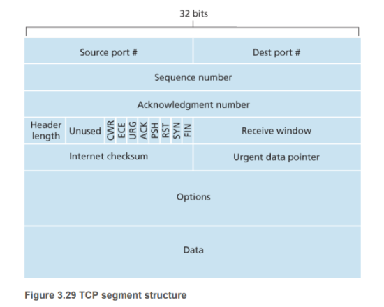

numero de secuencia y de ack son usados por sender y receiver para garantizar una entrega confiables

- se dice que TCP provee cumulative ack, porque solo reconoce bytes desde el primer byte faltante en el stream.

- el campo receive windows se usa para controlar el flujo(indica cuantos bytes el receptor puede aceptar)

- el campo header lenght especifica el tamaño del header, esto es necesario porque el header puede tener opciones, por ejemplo para establecer la conexion se pueden usar opciones para negociar el tamaño del segmento, o para establecer una conexion segura se pueden usar opciones para negociar los algoritmos de cifrado, etc.

- el campo options se usa cuando el sender y receiver negocian el tamaño maximo del segmento.

- el bit de ACk indica que el valor cargado en el campo ack es valido

- los bits RST, SYN, Y FIN son para el setup y el tear down

- los bits CWR y ECE son para el control de congestion, CWR indica que el sender ha reducido su tasa de envio y ECE indica que el sender ha recibido un mensaje de congestion.

- El bit psh indica que al receiver que debe pasar inmediatamente los datos a capa de aplicacion

- el bit urg indica que el campo urgent pointer es valido, el campo urgent pointer se usa para indicar que hay datos urgentes en el segmento, esto se puede usar para enviar datos de control o para enviar datos que necesitan ser procesados inmediatamente, por ejemplo si se esta transmitiendo un archivo y se quiere enviar un mensaje de control para indicar que se ha terminado de enviar el archivo, se puede usar el bit urg para indicar que el mensaje de control es urgente y debe ser procesado inmediatamente.

- TCP usa un mecanismo de timeout/retransmision para segmentos perdidos.

- recordar que si bien el servicio de IP no es confiable, TCP tiene que serlo, para ello tiene que construir un servicio de transferencia confiable sobre el servicio de ip

- se recomienda un solo timer de retransmision.

- se dice que el mecanismo de errores TCP es un hibrido de GBN y SR

- para que llevar un control de flujo el sender tiene un buffer de tamaño RcvBuffer, talque lastByteRcvd es el numero de secuencia del ultimo byte recibido, lastByteAcked es el numero de secuencia del ultimo byte reconocido por un ACK, y RcvWindow es el tamaño de la ventana de recepcion, entonces el sender puede enviar bytes con numero de secuencia menor a lastByteAcked + RcvWindow, esto garantiza que el sender no envie mas bytes de los que el receptor puede aceptar.

### procedimiento para establecer una conexion TCP

1. el cliente envia un segmento con el bit SYN seteado, este segmento no tiene datos, solo tiene el header, el numero de secuencia es un numero aleatorio que se genera para identificar la conexion, este numero de secuencia se llama ISN (initial sequence number).

2. el servidor responde con un segmento con los bits SYN y ACK seteados, el numero de secuencia es otro numero aleatorio que se genera para identificar la conexion, este numero de secuencia se llama ISN del servidor, el campo ack tiene el valor del ISN del cliente + 1, esto indica que el servidor ha recibido el segmento del cliente y esta reconociendo ese segmento.

3. el cliente responde con un segmento con el bit ACK seteado, el numero de secuencia es el ISN del cliente + 1, el campo ack tiene el valor del ISN del servidor + 1, esto indica que el cliente ha recibido el segmento del servidor y esta reconociendo ese segmento, en este punto la conexion esta establecida y ambos host pueden empezar a enviar datos a traves de la conexion.

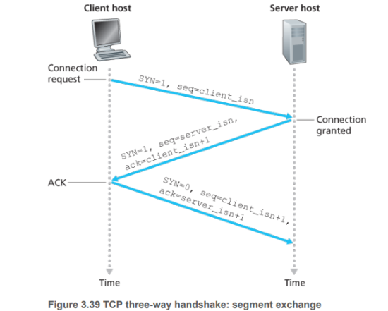

### para cerrar una conexion TCP

1. el cliente envia un segmento con el bit FIN seteado, esto indica que el cliente ha terminado de enviar datos y quiere cerrar la conexion.

2. el servidor responde con un segmento con el bit ACK seteado, esto indica que el servidor ha recibido el segmento del cliente y esta reconociendo ese segmento, en este punto el cliente ha cerrado su lado de la conexion pero el servidor todavia puede enviar datos al cliente.

3. el cliente reconoce el segmento de shutdown del servidor con un segmento con el bit ACK seteado, esto indica que el cliente ha recibido el segmento del servidor y esta reconociendo ese segmento, en este punto la conexion esta completamente cerrada y ambos host han terminado de enviar datos a traves de la conexion, se desalocan los recursos asociados a la conexion en ambos host.

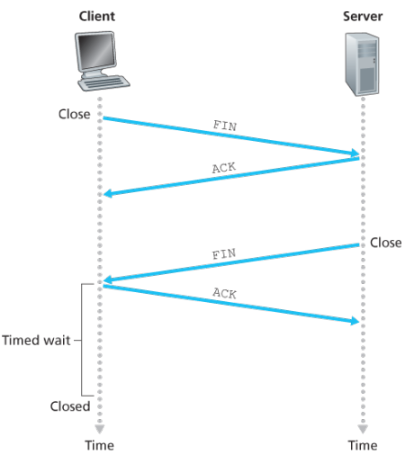

### casos borde

1. dos host comparten un router con buffer infinito

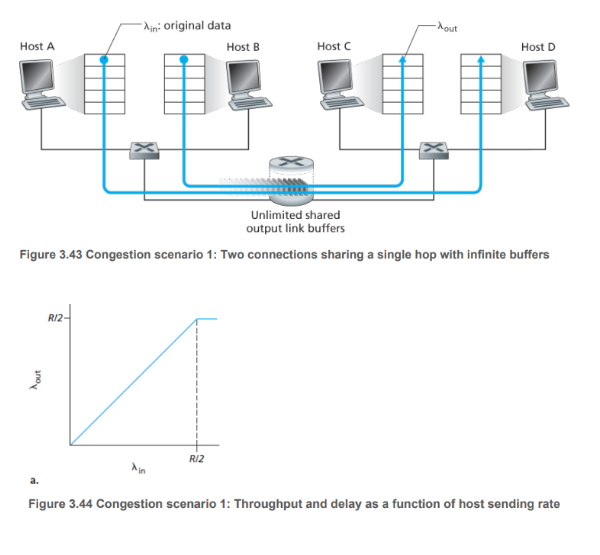

en el grafico se muestra el throughput de la conexion, cantidad de bytes por segundo en el receiver, en funcion del rate de envio del sender, con un sending entre 0 y R/2 el T va a ser igual al rate de envio, ahora si este supera R/2 este queda limitado a R/2 por la capacidad del linker, esto se llama el efecto de cuello de botella, el throughput de la conexion esta limitado por el enlace mas lento en la ruta entre el sender y el receiver, en este caso el enlace con capacidad R/2, por lo tanto el sender no puede enviar a una tasa mayor a R/2 sin que se produzca congestión en el enlace, esto se puede solucionar utilizando un mecanismo de control de congestion para limitar la tasa de envio del sender y evitar que se produzca congestión en el enlace.

2. dos host comparten un router con buffer finito

que sea finito implica que algunos paquetes se van a perder pero sigue siendo confiable porque se van a retransmitir.

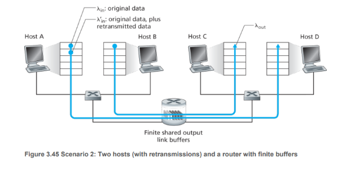

lo que si se observa es que el throughput de la conexion se ve afectado por la capacidad del buffer, si el buffer es muy pequeño, el sender no puede enviar a una tasa mayor a la capacidad del buffer sin que se produzca congestión en el enlace, esto se puede solucionar utilizando un mecanismo de control de congestion para limitar la tasa de envio del sender y evitar que se produzca congestión en el enlace.

3. 4 hosts, routers con buffers finitos y multishop 

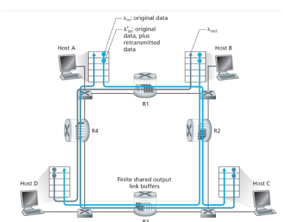

aca se ve el costo real de soltar un paquete debido a congestion, la capacidad de transmision que fue usada por todos los links fue desperdiciado debido a la perdida del paquete, TCP para controlar la congestion reduce o aumenta el rate de envio dependiendo de la congestion de la red, para eso usa congestion ward con el objetivo de limitar el send rate segun la cantidad de ack pendientes

lastByteSent - lastByteAcked <= min{congestionWindowSize}

### como TCP persive la congestion

esto lo hace mediante la perdida de paquetes, entonces ante un timeout o 3 ack por un mismo segmento TCP percive la congestion, por contraparte si recibe todos los ack interpreta que no hay congestion, entonces TCP aumenta el congestion window size, esto se llama congestion avoidance, si TCP percive congestion reduce el congestion window size a la mitad, esto se llama multiplicative decrease, si TCP no percive congestion aumenta el congestion window size en 1 MSS cada vez que recibe un ack, esto se llama additive increase, entonces TCP tiene un comportamiento de aumento aditivo y disminucion multiplicativa, esto se llama AIMD (additive increase multiplicative decrease), este algoritmo permite a TCP adaptarse a las condiciones de la red y evitar la congestión.

#### algunas guidelines

- un paquete perdido implica congestion, por lo tanto TCP reduce el congestion window size a la mitad, esto se llama multiplicative decrease.

- un ack indica que no hay congestion, por lo tanto TCP aumenta el congestion window size en 1 MSS cada vez que recibe un ack, esto se llama additive increase.

- prueba de bandwith: TCP aumenta el congestion window size en 1 MSS cada vez que recibe un ack, esto permite a TCP probar la capacidad de la red y adaptarse a las condiciones de la red, si la red tiene una capacidad mayor a la que TCP esta usando, TCP va a aumentar el congestion window size y va a aumentar el throughput de la conexion, si la red tiene una capacidad menor a la que TCP esta usando, TCP va a percibir congestion y va a reducir el congestion window size, esto permite a TCP adaptarse a las condiciones de la red y evitar la congestión.

