# unidad 4: capa de red

la capa de red es la capa encargada de enruta(encargarse de mover) los paquetes de un host enviador a otro host receptor, incluso si estos hosts se encuentran en redes diferentes. esta capa es la encargada de determinar la ruta que los paquetes deben seguir para llegar a su destino.

## funciones de la capa de red

la capa de red tiene 2 funciones principales:

- forwarding: cuando un paquete llega a un enlace de entrada el reouter mueve ese paquete a una salida apropiada, toma nano segundos y se suele implementar en hardware.

- routing: se debe determinar la ruta o el camino a media que viajan del enviador al receptor, se mide en segundos y se suele implementar en software.

basicamente routing es planear todo el camino desde que el paquete es enviado hasta que llega a su destino mientras que forwarding es mas bien interno, es decir, se encarga de mover el paquete de un enlace a otro dentro del router.

### tabla de forwarding

en el header de cada paquete se evaluan algunos campos con los que se indexa esta tabla, el valor almacenado en la tabla para dicho indice es el indica cual es la salida a la que se debe enviar el paquete, **el algoritmo de routing determina el contenido de esta tabla**.

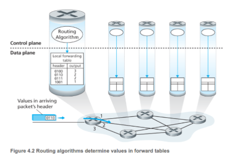

## servicios que puede ofrecer la capa de red

- **entrega garantizada**: un paquete eventualmente llega al receptor.

- **entrega garantizada con retraso limitado**: ademas de garantizar la entrega, se garantiza que el paquete llegará en un tiempo determinado.

- **entrega ordenado**: los paquetes llega en el mismo orden en el que fueron enviados.

- **minimo bandwidth garantizado**: semula el comportamiento de un enlace de transmision de un determinado bit eate, siempre que el host transmita bits por debajo de ese rate, los paquetes llegarán a su destino.

- **seguridad**: se podrian encriptar los datagramas en la fuente y desencriptar al llegar a destino para preservar la confidencialida de los datos.

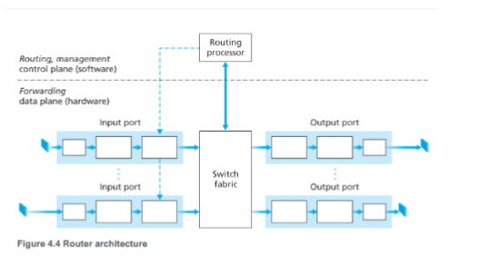

## componentes de un router

- **input ports**: cumple la funcion fisica de "terminar" l enlace fisico entrante en router, es decir que recibe los bits del enlace fisico y los convierte en paquetes, ademas de que se encarga de indexar la tabla de forwarding para determinar a que salida se debe enviar el paquete, aca se consulta la tabla de forwarding.

- **switching fabric**: es el componente encargado de mover los paquetes desde la entrada a la salida, puede ser un bus compartido, una red de conmutacion o un bus dedicado.

- **output ports**: almacena paquete que recibe el switch y los transmite al enlace de salida implementando funciones de la capa de enlace y de la capa fisica.

- **routing processor**: ejecuta la funciones del plano de control, en routers tradicioneles, ejecuta protocolos de reouting, mantiene tablas de routing, informacion de estado de enlaces, en routers SDN ejecuta el software de control que recibe instrucciones de un controlador SDN centralizado.

## Proceso de una entrada

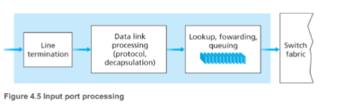

no escalaria que en la tabla de forwarding haya una fila por direccion ya que estas son de 8 bits, lo que se puede hacer es agrupar las direcciones por prefijo:

| Prefix | Link interface |
| --- | --- |
| 11001000 00010111 00010 | 0 |
| 11001000 00010111 0001100000 | 1 |
| 11001000 00010111 0001100011 | 2 |
| otherwise | 3 |

si una direccion matchea con mas de un prefijo el router usa la regla del prefijo mas largo(longest prefix match), es decir, se elige el prefijo que matchea con la direccion y que tiene mas bits.

en algunos diseños a un paquete se le puede bloquear temporalmente en el pase al fabric switch si paquete de otros inputs lo estan usando, en tal caso el paquete queda encolado y programado para pasar al switch eventualmente.

ademas del lookup en  el router se ejecutan otras acciones importantes: procesos de la capa fisica y de enlace, chequeo de los campos de nuemero de ersion, cheksum y ttl(los ultimos dos son escritos en esta etapa) y la actualizacion de los contadores relativos al manejo de red.

nota: todo esto es en un caso de abstraccion match plus action, en la realidad el proceso es mas complejo y puede involucrar mas pasos.

## el switching 

el switching es el proceso de mover un paquete desde un input port a un output port, esto se puede hacer de varias formas:

- **switching por memoria**: los primeros routers eran computadoras tradicionales, con el swith bajo control directo de la CPU, los puertos de input y output funcionaban como dispositivos E/s de un SO, el puerto de entrada avisaba mediante una señal de interrupcion la llegada de un paquete, luego el paquete se copiaba a la memoria del procesador, el procesador entonces extraia de los headers la direccion destino y a partir de la tabla de forwarding, copiaba el paquete al puerto de salidam en este escenario si la bandwith de la memoria soporta operaciones con un maximo de B paquetes por segundo, entonces el rate total de paquetes pueden ser transferidos de la entrada a la salida B/2, ademas los paquetes no pueden ser transferidos al mismo tiempo, ya que la memoria solo puede hacer una operacion de lectura/escritura a la vez.

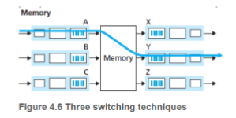

- **via bus**: el puerto de entrada transfiere el paquete directamente al puerto de la salidad mediante un bus compartido sin intervension del procesador de routing, esto se hace pre agregando un label (header) al paquete indicando puerto de salida y transmitiendo el paque al bus, todos los puertos de salida reciben el paquete, pero solo se lo queda aquel que matchea el label, por el bus pasa un paquete por vez, por ello el router va tan rapido como el bus.


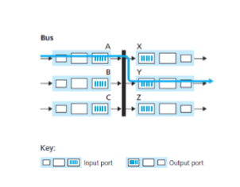

- **via red interconectada**: una solucion para la limitacion de bandwidth que ofrece utilizar un unico bus compartido es un switch de tipo crossbar, consiste en 2N buses que conectan N puertos de entrada por N puertos de salida, cada bus vertical intersecta cada bus horizontal en un crosspoint que puede ser abierto o cerrado, en cualquier momento por el controlador del switch fabric, cuando llega un paquete al puerto A que tiene que ser transmitido al puerto y el controlador cierra la interseccion A-Y y envia el paquete por ese bus, nota que aca el puerto A podria mandar al tiempo un paquete al puerto X porque no son el mismo bus o sea que se pueen enviar paquetes paralelos, ademas es non blocking a menos que dos paquetes quieran ir a la misma salida.

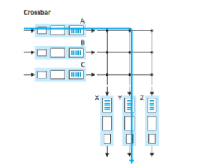

se pueden formar colas de paquetes tanto en los puertos de entrada como en los de salida, la longitud de las colas dependera de la velocidad del switch, del trafico y de la velocidad de la linea, el problema es que a medida que se enconlen mas paquetes, mayor la chance de que se pierdan paquetes por overflow, ademas de que el delay de los paquetes aumenta, esto se puede solucionar con un switch mas rapido o con una politica de manejo de colas mas inteligente.


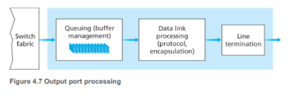

si el switch no es tan rapido como para poder procesar todos los paquetes con delay se puede generar un head-of-the-line blocking, esto ocurre cuando un paquete en la cabeza de la cola bloquea a los paquetes que estan detras de el, incluso si estos paquetes podrian ser enviados a otras salidas, esto se puede solucionar con un switch mas rapido o con una politica de manejo de colas mas inteligente.

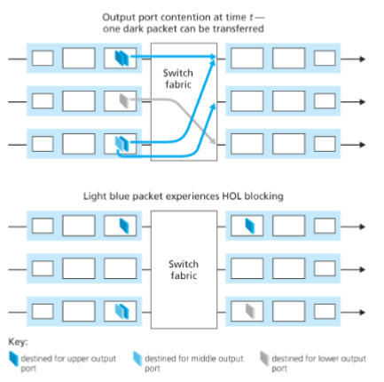

suponiendo que rswitch es N veces mas rapido que la Rline y que todos los paquetes van al mismo puerto de salida, n paquetes nuevos van a llegar al puerto de salida, como el puerto de salida solo puede transmitir de a un paquete, los N paquetes nuevos van a tener que hacer cola, una consecuencia de esto es que el puerto de salida va a tener que elegir que paquete transmitir pimrero al enlace de salida(paquet schedualler)

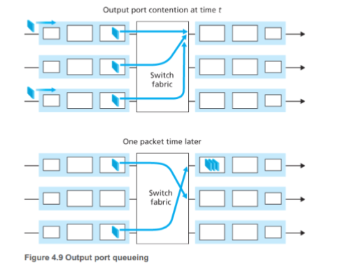

## politicas de manejo de colas

los paquetes que llegan a la cola de un puerto de salid esperan para ser transmitidos si el enlace esta ocupado, si el buffer no tiene mas espacio para paquetes entrantes la politica de manejo de colas decide que hacer con los paquetes entrantes, las politicas mas comunes son:


- **first in first out**: los paquetes se transmiten en el orden en el que llegan, si el buffer esta lleno se descartan los paquetes entrantes, esta politica es simple pero no es justa, ya que un paquete que llega a la cola puede ser bloqueado por paquetes que llegaron antes, incluso si estos paquetes van a otras salidas.

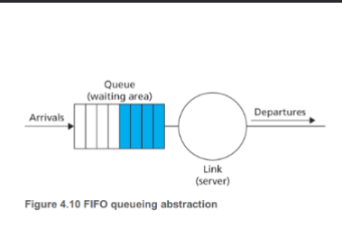

- **priority queuing**: los paquetes se clasifican en diferentes clases de prioridad, un operador de red puede configurar una cola para que los paquetes que llevan informacion del manejo de red tengan mayor prioridad, asi como paquetes con mensajes realtime por sobre mails, tipicamente cada prioridad tiene su propia cola, cuando se elige el paquete a transmitir se transmite el de la cola con mayor prioridad, de una prioridad se usa fifo, esta politica es mas justa que fifo, pero puede generar starvation de paquetes de baja prioridad.

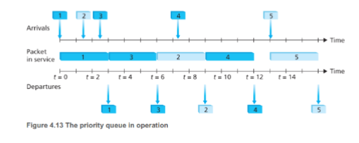

- **round robin y wfq(weighted fair queuing)**: los paquetes se dividn en colas de prioridad, pero se va alterando el servicio entre cola, asi ningun paquete queda demaciado tiempo esperando en una cola, WFQ se diferencia de RR en que cada clase puede recibir una cantidad de servicio distinta en algun intervalo de tiempo(o sea que se le asigna un peso a cada clase), esta politica es mas justa que las anteriores, pero es mas compleja de implementar.

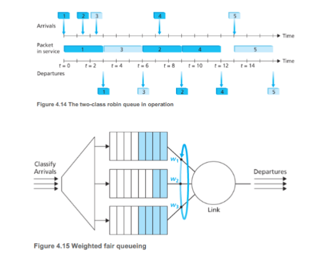

## datagramas

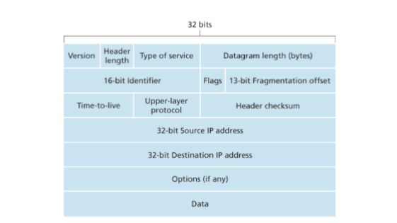

en la capa de red, los paquetes se llaman datagramas, cada datagrama y contienen toda la informacion necesaria para ser enrutados, estos contienen

- **version**: indica la version del protocolo de red, por ejemplo IPv4 o IPv6.

- **header length**: indica la longitud del header en bytes, esto es necesario porque el header puede tener opciones de longitud variable, se usa para identificar donde comienza el payload.

- **type of service**: indica la prioridad del datagrama, indica el tipo de servicio de datagrama, ejemplo: real-time: tipo telefono, no real-time: tipo mail, etc.

- **datagram length**: indica la longitud total del datagrama en bytes, incluyendo header y payload, esto es necesario para que el receptor sepa cuando termina el datagrama.

- **identification, flags, fragment offset**: tiene que ver con la fragmentacion IP, mas adelante desarrollamos esto.

- **time to live**: indica el numero maximo de saltos que un datagrama puede hacer antes de ser descartado, esto es necesario para evitar que los datagramas queden atrapados en un ciclo infinito en la red.

- **protocol**: se usa al llegar a destino para identificar a que protocolo de capa de transporte se le debe entregar el payload, 6 indica TCP, 17 indica UDP, este numero es analogo al numero de puerto en la capa de transporte, pero a nivel de red.

- **header checksum**: es un numero que se calcula a partir del header del datagrama, se usa para detectar errores en el header, el receptor calcula el checksum del header recibido y lo compara con el checksum enviado, si no coinciden, el datagrama es descartado.

- **source IP address**: es la direccion IP del host enviador, se usa para que el receptor sepa quien envio el datagrama, ademas de que se puede usar para enviar un mensaje de error al host enviador si el datagrama no puede ser entregado a su destino.

- **destination IP address**: es la direccion IP del host receptor, se usa para que el router sepa a donde enviar el datagrama, ademas de que se puede usar para enviar un mensaje de error al host enviador si el datagrama no puede ser entregado a su destino.

- **options**: es un campo opcional que puede contener informacion adicional, como por ejemplo la ruta que el datagrama debe seguir, o el tiempo de vida del datagrama, este campo no se usa mucho en la practica.

- **payload**: es la parte del datagrama que contiene los datos que se quieren enviar, esta parte es entregada al protocolo de capa de transporte indicado en el campo protocol, el payload puede tener una longitud variable, dependiendo de la longitud total del datagrama y de la longitud del header.

## cantidad maxima de data enviada por un enlace

se denomina MTU(maximum transmission unit) a la cantidad maxima de data que se puede enviar por un enlace, cada datagrama ip se encapsula dentro de un frame de capa de enlace para poder transportalos de un router a otro, entonces el MTU limita mucho el tamaño del datagrama ip, el problema es que cada enlace tiene un protocolo distinto y por consecuencia distinto MTU, ejemplo: ethernet tiene un MTU de 1500 bytes, mientras que el protocolo PPPoE tiene un MTU de 1492 bytes, esto puede generar problemas si un datagrama ip es mas grande que el MTU del enlace por el que tiene que pasar, para solucionar esto se utiliza la fragmentación IP, los fragmentos son preensamblado antes de llegar a la capa de transporte destino, este reensamble se hace en los hosts finales.


para que el host destino pueda identificar los fragmentos entre los datagramas y reconstruirlos, los diseñdores IP incluyeron los headers de identifiacion, flag and fragmentation offset, cuando se crea el datagrama, el host que envia le pone un numeor de identificiacion ademas de las direcciones fuente y destino, cuando el router necesita fragmentar un  datagrama le pone a cada fragmento de un datagrama el mismo numero de identificacion, ademas de un flag indicando si el fragmento es el ultimo o no, y un offset indicando la posicion del fragmento dentro del datagrama original, el host destino entonces puede usar esta informacion para reconstruir el datagrama original a partir de los fragmentos recibidos, tambien se pone un offset field en el header de cada fragmento indicando la posicion del fragmento dentro del datagrama original, esto es necesario para que el host destino pueda reconstruir el datagrama original en el orden correcto, ademas de que se puede usar para detectar si falta algun fragmento, si falta algun fragmento el host destino no puede reconstruir el datagrama original y por lo tanto no puede entregar el payload al protocolo de capa de transporte indicado en el campo protocol.

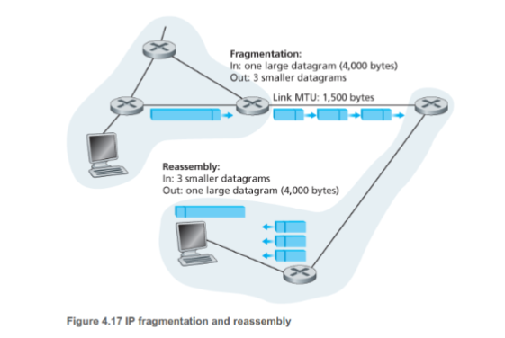

## ipv4

tipicamente un host tiene un solo enlace con la red, el borde entre este host y el enlace fisico se llama interfaz, el borde entre el router y cualquiera de sus enlaces tambien se llama interfaz(este ultimo tiene varios interfaces), IP requiere que cada interfaz de host y router tenga su interfaz o sea que la direccion IP esta asociada a la interfaz y no al host o router.

cada direccion ip tiene 32 bits(4 bytes) o sea hay una posibilidad de 2^32 direcciones ip posibles, tipicamente se escriben en dotter-decimal notation, cada byte se escribe en decimal separado de otros bytes por punto

```shell
192.32.216.9 = 11000000.00100000.11011000.00001001

```

cada interfaz debe tener una ip unica en el mundo, esta no es arbitraria, de heco hay una porcion de la ip que se determina por la subred a la que esta conectada, una red que conecta distintas interfaces de host y una unterfaz de router forma una subred

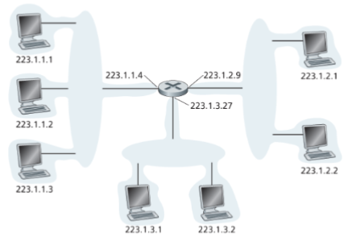

la notacion /24 se conoce como mascara subred, indica que los 24 bits mas a la izquierda definen la direccion subred

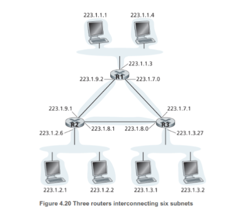

cuando un router externo a la organizacion transmite un datagrama cuya direccion pertenece a la organizacion solo neceita los primeros x bits asi reduce el tamaño de las tablas de forwarding, los ultimos bits solo importan dentro de la organizacion, cuando un host envia un datagrama a la direccion 255.255.255.255 el mensasej va a ser entregado a todos los hostos de la misma subred(broadcast address)


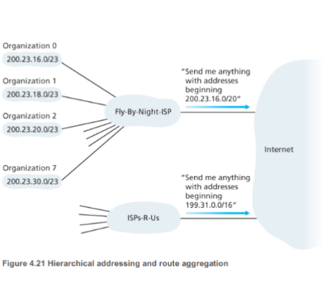

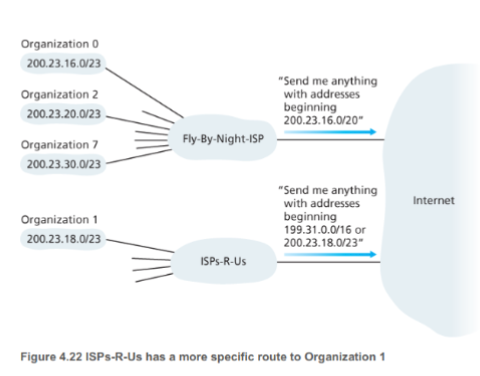

Para poder obter un bloque de direcciones ip para utilizar en una subred el abminitrador de red debe comunicarse con su ISP, el ISP ya tiene bloques de ip reservadas, entonces deberia dividir estos bloques en 8 partes iguales y contiguras para poder darle a hasta 8 organizaciones distintas

## dhcp

las direcciones IP se manejan bajo la autorizacion de **internet corporation for assigned names and numbers (ICANN)**, una vez que el host tiene su bloque de direcciones puede asignar direcciones puede asignar ip individuales al router y host, tipicamente administrandolas manualmente,o tambien por Dynamic host configuration protocol (DHCP), este protocolo permite a los host obtener una direccion ip dinamicamente cada vez que se conectan a la red, tambien permite saber su DNS local, mascara subred, la direccion del primer router, etc.

DHCP es un protocolo de tipo cliente servidor

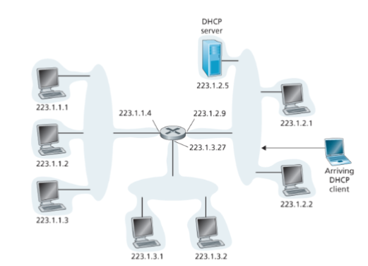

- **DHCP server discover**: cuando se conecta un nuevo host envia un dhcp discovery message dentro de un paquete UDP al puerto 67 de la direccion de broadcast

- **DHCP server offer**: el DHCP server responde con un DHCP offer message que es broadcasteado a toda la subred, como puede haber varios servidores , el clienteva a tener para elegir, cada offer contiene: id transaccional del discover message recibido, la ip propuesta para el cliente, la mascar de red y el tiempo de lease de la ip propuesta.

- **DHCP client request**: el cliente responde con un DHCP request message que es broadcasted a toda la subred, repitiendo los parametros de configuracion

- **DHCP server ack**: el DHCP server responde con un DHCP ack message que es broadcasted a toda la subred, confirmando la asignacion de la ip al cliente, el cliente entonces puede usar la ip asignada para comunicarse con otros host en la red.

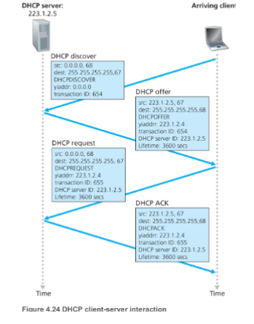

un aproach para la alocacuin de direcciones IP es el network address translation (NAT)

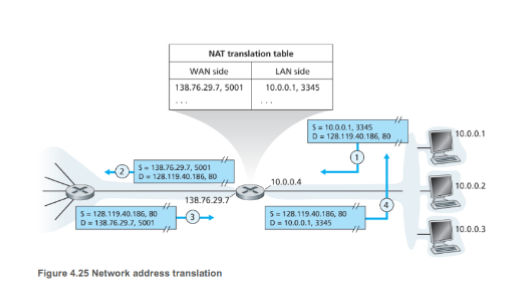

el router NAT visto dese fuera se comporta como el unico dispositivo con una unica ip, siguiendo el ejemplo todo el trafico sale del router local llevando la misma ip y entra con esa misma ip, para saber a cual dispositivo enviar el trafico recibido existe la NAT translation table.

## ipv6

como la cantidad de direcciones ipv4 se esta quedando corta se creo ipv6

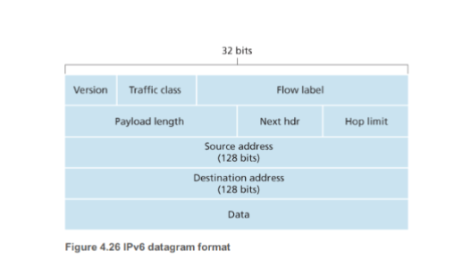

- tiene mas direcciones: ipv6 tiene 128 bits en lugar de 32 bits, lo que permite una cantidad mucho mayor de direcciones ip disponibles.

- header fijo de 40 bytes: ipv6 tiene un header fijo de 40 bytes, lo que simplifica el procesamiento de los datagramas y mejora el rendimiento.

- flow label: ipv6 incluye un campo de flow label que permite identificar flujos de datagramas relacionados, lo que facilita la implementación de servicios de calidad de servicio (QoS).

### descripcion de los campos ipv6

- **version**: indica la version del protocolo de red, en este caso siempre es 6.

- **traffic class**: indica la prioridad del datagrama, similar al campo type of service en ipv4.

- **flow label**: es un campo de 20 bits que se utiliza para identificar flujos de datagramas relacionados, lo que facilita la implementación de servicios de calidad de servicio (QoS).

- **payload length**: indica la longitud del payload en bytes, esto es necesario para que el receptor sepa cuando termina el datagrama.

- **next header**: indica el tipo de header que sigue al header ipv6, esto es necesario para que el receptor sepa como interpretar el payload, por ejemplo si el next header es 6, el payload es un datagrama tcp, si el next header es 17, el payload es un datagrama udp.

- **hop limit**: es similar al campo time to live en ipv4, indica el numero maximo de saltos que un datagrama puede hacer antes de ser descartado.

- **source address**: es la direccion ip del host enviador, se usa para que el receptor sepa quien envio el datagrama, ademas de que se puede usar para enviar un mensaje de error al host enviador si el datagrama no puede ser entregado a su destino.

- **destination address**: es la direccion ip del host receptor, se usa para que el router sepa a donde enviar el datagrama, ademas de que se puede usar para enviar un mensaje de error al host enviador si el datagrama no puede ser entregado a su destino.

- **payload**: es la parte del datagrama que contiene los datos que se quieren enviar, esta parte es entregada al protocolo de capa de transporte indicado en el campo next header, el payload puede tener una longitud variable, dependiendo de la longitud total del datagrama y de la longitud del header.

### campos de ipv4 que no estan en ipv6

- **fragmentation/reassembly**: ipv6 no tiene campos de fragmentation y reassembly, esto se debe a que ipv6 no permite la fragmentacion de datagramas, en ipv6 el host enviador debe asegurarse de que el datagrama que envia no sea mas grande que el MTU del enlace por el que tiene que pasar, si el datagrama es mas grande que el MTU, el host enviador debe fragmentar el datagrama antes de enviarlo. esto se hace para simplificar el procesamiento de los datagramas y mejorar el rendimiento, ademas de que la fragmentacion de datagramas puede generar problemas de seguridad, ya que un atacante podria enviar datagramas fragmentados para evadir los sistemas de deteccion de intrusos (IDS).

- **header checksum**: ipv6 no tiene un campo de header checksum, esto se debe a que ipv6 utiliza un mecanismo de deteccion de errores diferente, en ipv6 se utiliza un campo de checksum en el header del protocolo de capa de transporte (tcp o udp) para detectar errores en el header ipv6, ademas de que se puede usar para detectar errores en el payload, esto se hace para simplificar el procesamiento de los datagramas y mejorar el rendimiento, ademas de que el campo de header checksum en ipv4 no es muy efectivo para detectar errores, ya que solo detecta errores en el header y no en el payload.

- **options**: ipv6 no tiene un campo de options, esto se debe a que ipv6 utiliza un mecanismo de extensiones para agregar informacion adicional a los datagramas, en ipv6 se pueden agregar headers de extension entre el header ipv6 y el payload para agregar informacion adicional, como por ejemplo la ruta que el datagrama debe seguir, o el tiempo de vida del datagrama, esto se hace para simplificar el procesamiento de los datagramas y mejorar el rendimiento, ademas de que el campo de options en ipv4 no es muy utilizado en la practica.

para poder comunicarse entre si se hace **tunneling** entre ipv4 e ipv6, esto se hace encapsulando un datagrama ipv6 dentro de un datagrama ipv4, el datagrama ipv4 se utiliza para transportar el datagrama ipv6 a traves de la red, una vez que el datagrama ipv4 llega a su destino, el header ipv4 es removido y el datagrama ipv6 es procesado normalmente.

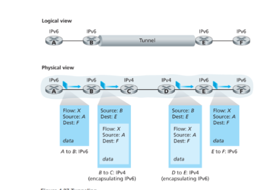

cada entrada de la tabla forwarding (flow table) incluye:

- un set de valores para el campo headers, con los que matchear paquetes entrantes

- un set de contadores que se van actaulizando a medida que matchean los paquetes con las entradas de la tabla

- un set de acciones a ejecutar cuando un paquete matchea con la entrada, ejemplo: enviar el paquete a una salida especifica, descartar el paquete, modificar el header del paquete, etc.